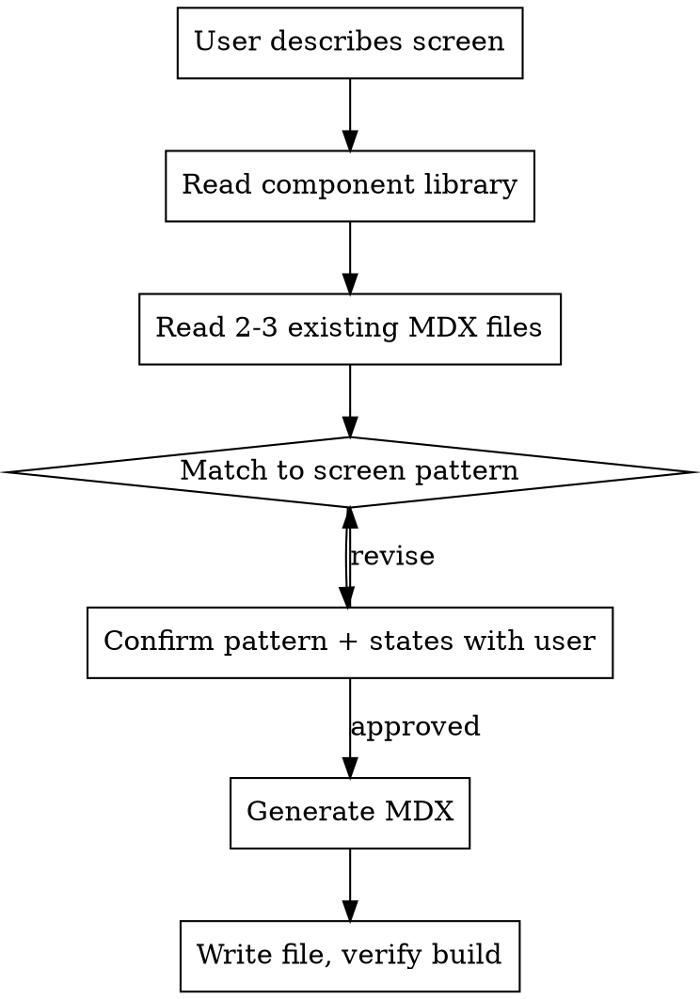

# Generate MDX Screen

Generate consistent MDX screen files by matching the user's description to proven layout patterns, using only the project's existing component library.

## Process



## Step 1: Learn the project

Read these files BEFORE generating anything:

1. `src/content/mdx-components.tsx` — the component library (props, variants, available components)
2. 2-3 existing `content/**/*.mdx` files — to learn the project's layout conventions

NEVER invent components. Use only what exists in `mdxComponents` export map.

## Step 2: Match to a screen pattern

Map the user's description to one of these patterns. Each pattern defines which components to use and how to arrange them.

### List Screen
**Triggers:** "list of...", "show items", "appointments", "history", "results"

```
ScreenHeader title="..."
Stack gap="md" className="p-4"
├─ Card className="p-0 overflow-hidden"
│  ├─ ListItem icon label description trailing={<Badge>}
│  ├─ ListItem ...
│  └─ ListItem ...
└─ Footer > Button "Action"
```

**Typical states:** `loading`, `empty`, `loaded`
**State differences:**
- loading: text "Loading...", disabled footer button
- empty: Note type="info" with empty message, no Card, enabled footer
- loaded: Card with ListItem rows, enabled footer

### Selection Screen
**Triggers:** "select", "choose", "pick", "type selector"

```
ScreenHeader title="..."
Stack gap="md" className="p-4"
├─ p "Select..."
├─ Stack gap="sm"
│  ├─ RadioCard selected > "Option A"
│  ├─ RadioCard > "Option B"
│  └─ RadioCard > "Option C"
├─ Card (conditional extra fields when certain option selected)
└─ Footer > Button "Save"
```

**Typical states:** one per option (e.g., `acute`, `prevention`, `follow-up`)
**State differences:** which RadioCard has `selected`, conditional cards below

### Form Screen
**Triggers:** "form", "input", "login", "sign up", "edit", "fill"

```
ScreenHeader title="..."
Stack gap="md" className="p-4"
├─ Card
│  ├─ Input label="..." placeholder="..."
│  ├─ Input label="..." type="password"
│  └─ Button "Submit"
└─ (optional) Note for errors/success
```

**Typical states:** `idle`, `filling`, `error`, `success`
**State differences:**
- idle: empty inputs, enabled button
- filling: inputs with values, typing indicator
- error: Note type="error" above form
- success: Note type="success", form hidden or disabled

### Detail Screen
**Triggers:** "detail", "profile", "view", "info card", "appointment detail"

```
ScreenHeader title="..."
Stack gap="md" className="p-4"
├─ Card
│  └─ div.flex > Avatar + name/subtitle/meta
├─ Card (info sections)
│  ├─ ListItem icon label description
│  └─ ListItem icon label description
└─ Footer > Stack gap="sm" > Button + Button variant="outline"
```

**Typical states:** `default`, `editing`, `loading`

### Status Screen
**Triggers:** "success", "confirmation", "error page", "empty state", "finding", "result"

```
ScreenHeader title="..."
div.flex.flex-col.items-center.justify-center.px-6.py-16
├─ div (icon circle) > emoji
├─ h2 "Title"
├─ p "Description"
└─ (optional) Card with summary info
Footer > Stack gap="sm" > Button + Button variant="outline"
```

**Typical states:** `searching`/`found`, `success`/`error`
**State differences:** icon, title, description, and footer actions change

### Picker Screen
**Triggers:** "doctor", "person", "contact", "horizontal scroll", "carousel"

```
ScreenHeader title="..."
Stack gap="md" className="p-4"
├─ div.flex.gap-3.overflow-x-auto (horizontal scroll)
│  ├─ Avatar circle (selected: border-teal-500 bg-teal-50)
│  ├─ Avatar circle (unselected: border-neutral-200)
│  └─ + Add circle (dashed border)
├─ Section label
│  └─ Stack gap="sm" > Card items
└─ (optional) Footer
```

**Typical states:** one per selection option

## Step 3: Confirm with user

Present this to the user BEFORE generating:

```
Screen: [name]
Path: content/[path].mdx
Pattern: [List/Selection/Form/Detail/Status/Picker]

Layout:
  [tree mockup from pattern above, filled with their data]

States:
  - state1: description
  - state2: description
  - state3: description

Ready to generate?
```

Use `AskUserQuestion` to confirm.

## Step 4: Generate MDX

### File structure

```mdx
---
type: screen
states:
  state-name:
    description: What this state shows
---

<ScreenHeader title="Screen Title" />

<Variant state="state-name">
  {/* Content using matched pattern */}
</Variant>

<Variant state="another-state">
  {/* Same structure, different data/visibility */}
</Variant>
```

### Rules

1. `ScreenHeader` goes OUTSIDE Variant blocks (shared across states)
2. Each Variant wraps `<Stack gap="md" className="p-4">` as main container
3. Use `<Card className="p-0 overflow-hidden">` when containing ListItems
4. Use `trailing={<Badge variant="...">text</Badge>}` on ListItem for status indicators
5. Use `<Footer>` with full-width `<Button className="w-full">` for actions
6. Selected items: `border-teal-500 bg-teal-50`
7. Disabled buttons: `opacity-50` + `variant="secondary"`
8. Section headers: `<p className="mb-2 text-xs font-semibold tracking-wider text-neutral-400">SECTION</p>`
9. Copy Tailwind class patterns from existing MDX files — do NOT invent new styling conventions

### After writing

Run `npx tsc --noEmit` to verify. Report the file path and states.

## Common Mistakes

| Mistake | Fix |
|---------|-----|
| Inventing components | Read `mdxComponents` map — only use what's there |
| Inconsistent styling | Copy exact Tailwind classes from existing MDX files |
| Missing Variant wrapper | Every state needs its own `<Variant state="...">` block |
| ScreenHeader inside Variant | Keep it outside — it's shared |
| Forgetting footer | Most screens need a sticky `<Footer>` with action buttons |
| Guessing patterns | Read 2-3 existing files first to match conventions |
