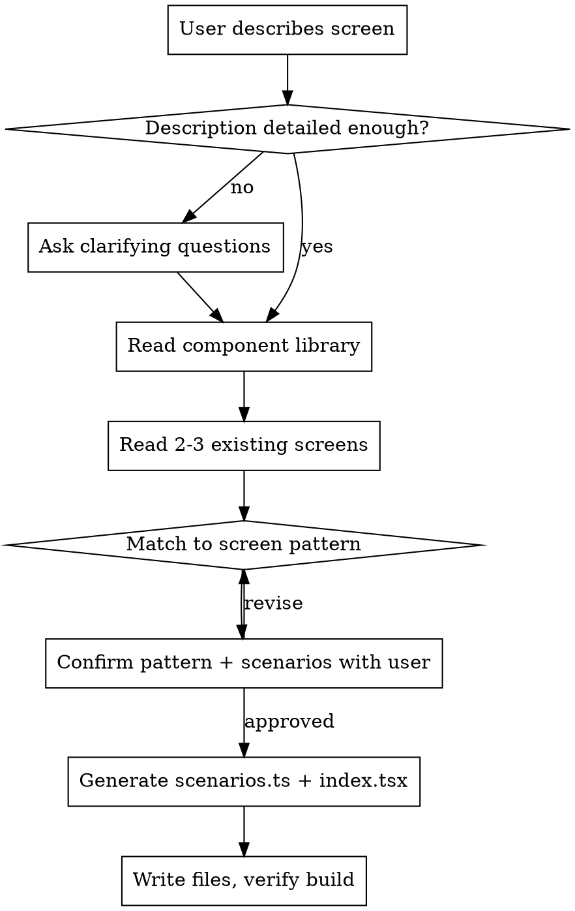

# Generate Screen

Generate consistent TSX screen components by matching the user's description to proven layout patterns, using only the project's existing component library.

## Process



## Step 0: Gather requirements (if description is vague)

Before doing anything, check whether the user's description covers these three things:

1. **Content & components** — what data/items appear on screen (e.g., "list of appointments with doctor name, date, and status badge")
2. **Scenarios** — what state variants to handle (e.g., "loading, empty, and loaded states")
3. **Flow context** — where this screen fits (e.g., "after booking confirmation, user lands here")

**A description is detailed enough if** it answers at least (1) and (2). Flow context is nice-to-have.

**A description is vague if** it only names the screen (e.g., "appointment list", "profile page", "settings screen") without specifying content or scenarios.

When the description is vague, use `AskUserQuestion` to ask up to 3 questions. Tailor questions to what's missing — don't ask about things already provided.

Example questions:

```
- "What information should each appointment row show?" (content)
- "What scenarios should this screen handle?" (scenarios)
- "Where does this screen appear in the flow?" (flow)
```

Do NOT guess and generate. Ask first, then proceed to Step 1.

## Step 1: Learn the project

Read these files BEFORE generating anything:

1. `src/components/screen.tsx` — the screen component library (props, variants, available components)
2. 2-3 existing `src/screens/{section}/{screen}/index.tsx` files — to learn the project's layout conventions
3. Their matching `src/screens/{section}/{screen}/scenarios.ts` files — to learn the scenario data pattern

NEVER invent components. Use only what exists in `src/components/screen.tsx`.

### Available components

| Component | Key Props | Usage |
|-----------|-----------|-------|
| `Button` | `variant`, `size`, `children` | Action buttons |
| `Card` | `children` | Container with border and shadow |
| `Input` | `label`, `placeholder`, `type` | Text input field |
| `Badge` | `variant`, `children` | Status indicator |
| `Note` | `type`, `children` | Info/warning/error/success callout |
| `ScreenHeader` | `title`, `subtitle` | Sticky header with back arrow |
| `ListItem` | `icon`, `label`, `description`, `required`, `selected`, `trailing` | Row item in a list |
| `RadioCard` | `selected`, `children` | Selectable radio option card |
| `Avatar` | `initials`, `variant`, `size` | Circular avatar |
| `Divider` | `label` | Horizontal divider, optionally with text |
| `Stack` | `gap`, `children` | Vertical flex container |
| `Textarea` | `label`, `placeholder`, `value`, `maxLength` | Multi-line text input |
| `Footer` | `children` | Sticky bottom bar |

All components accept `...rest` HTML attributes, so `data-flow-target` can be set directly as a prop on any of them.

## Step 2: Match to a screen pattern

Map the user's description to one of these patterns. Each pattern defines which components to use and how to arrange them.

### List Screen
**Triggers:** "list of...", "show items", "appointments", "history", "results"

```
ScreenHeader title="..."
Stack gap="md" className="p-4"
├─ Card className="p-0 overflow-hidden"
│  ├─ ListItem icon label description trailing={<Badge>}
│  ├─ ListItem ...
│  └─ ListItem ...
└─ Footer > Button "Action"
```

**Typical scenarios:** `loading`, `empty`, `loaded`
**Data shape:** `{ view: 'loading' | 'empty' | 'loaded' }`
**Rendering:**
- loading: text "Loading...", disabled footer button
- empty: Note type="info" with empty message, no Card, enabled footer
- loaded: Card with ListItem rows, enabled footer

### Selection Screen
**Triggers:** "select", "choose", "pick", "type selector"

```
ScreenHeader title="..."
Stack gap="md" className="p-4"
├─ p "Select..."
├─ Stack gap="sm"
│  ├─ RadioCard selected > "Option A"
│  ├─ RadioCard > "Option B"
│  └─ RadioCard > "Option C"
├─ Card (conditional extra fields when certain option selected)
└─ Footer > Button "Save"
```

**Typical scenarios:** one per option (e.g., `acute`, `prevention`, `follow-up`)
**Data shape:** `{ selectedType: 'acute' | 'prevention' | 'follow-up' }`
**Rendering:** conditional rendering based on `data.selectedType` — which RadioCard has `selected`, conditional cards below

### Form Screen
**Triggers:** "form", "input", "login", "sign up", "edit", "fill"

```
ScreenHeader title="..."
Stack gap="md" className="p-4"
├─ Card
│  ├─ Input label="..." placeholder="..."
│  ├─ Input label="..." type="password"
│  └─ Button "Submit"
└─ (optional) Note for errors/success
```

**Typical scenarios:** `idle`, `filling`, `error`, `success`
**Data shape:** `{ state: 'idle' | 'filling' | 'error' | 'success' }`
**Rendering:**
- idle: empty inputs, enabled button
- filling: inputs with values, typing indicator
- error: Note type="error" above form
- success: Note type="success", form hidden or disabled

### Detail Screen
**Triggers:** "detail", "profile", "view", "info card", "appointment detail"

```
ScreenHeader title="..."
Stack gap="md" className="p-4"
├─ Card
│  └─ div.flex > Avatar + name/subtitle/meta
├─ Card (info sections)
│  ├─ ListItem icon label description
│  └─ ListItem icon label description
└─ Footer > Stack gap="sm" > Button + Button variant="outline"
```

**Typical scenarios:** `default`, `editing`, `loading`

### Status Screen
**Triggers:** "success", "confirmation", "error page", "empty state", "finding", "result"

```
ScreenHeader title="..."
div.flex.flex-col.items-center.justify-center.px-6.py-16
├─ div (icon circle) > emoji
├─ h2 "Title"
├─ p "Description"
└─ (optional) Card with summary info
Footer > Stack gap="sm" > Button + Button variant="outline"
```

**Typical scenarios:** `searching`/`found`, `success`/`error`
**Rendering:** icon, title, description, and footer actions change per scenario

### Picker Screen
**Triggers:** "doctor", "person", "contact", "horizontal scroll", "carousel"

```
ScreenHeader title="..."
Stack gap="md" className="p-4"
├─ div.flex.gap-3.overflow-x-auto (horizontal scroll)
│  ├─ Avatar circle (selected: border-teal-500 bg-teal-50)
│  ├─ Avatar circle (unselected: border-neutral-200)
│  └─ + Add circle (dashed border)
├─ Section label
│  └─ Stack gap="sm" > Card items
└─ (optional) Footer
```

**Typical scenarios:** one per selection option

## Step 3: Confirm with user

Present this to the user BEFORE generating:

```
Screen: [name]
Folder: src/screens/{section}/{screen}/  (or src/screens/{screen}/ for standalone)
Pattern: [List/Selection/Form/Detail/Status/Picker]

Layout:
  [tree mockup from pattern above, filled with their data]

Scenarios:
  - scenarioKey: description (data shape)
  - scenarioKey: description (data shape)
  - scenarioKey: description (data shape)

Ready to generate?
```

Use `AskUserQuestion` to confirm.

## Step 4: Generate screen files

Each screen is a folder with two required files and optional locale files:

### `src/screens/{section}/{screen}/scenarios.ts`

```typescript
export type ScreenNameData = {
  // fields that vary between scenarios
}

export const scenarios = {
  scenarioKey: {
    label: 'Human-readable description',
    data: { /* ... */ } satisfies ScreenNameData,
  },
  anotherKey: {
    label: 'Another description',
    data: { /* ... */ } satisfies ScreenNameData,
  },
}
```

**Rules for scenarios.ts:**
- Export the data type as `<ScreenName>Data`
- Export must be named `scenarios` (exact name — the discovery hook reads this)
- Use `satisfies <DataType>` on each `data` object
- Keep mock data (arrays, objects) as module-level constants above `scenarios`
- Use single quotes for strings

### `src/screens/{section}/{screen}/en.json` (if screen uses i18n)

Create a co-located locale file with translation keys. The namespace is auto-derived from the path (`section/screen` → `section-screen`), so use `useTranslation('section-screen')` in the component.

### `src/screens/{section}/{screen}/index.tsx`

```tsx
import { ScreenHeader, Stack, /* ... */ } from '@/components/screen'
import type { ScreenNameData } from './scenarios'

export default function ScreenNameScreen({ data }: { data: ScreenNameData }) {
  const { /* destructure data fields */ } = data

  return (
    <>
      <ScreenHeader title="..." data-flow-target="ScreenHeader:..." />

      {/* Conditional rendering based on data */}
      <Stack gap="md" className="p-4">
        {/* ... */}
      </Stack>
    </>
  )
}
```

**Rules for index.tsx:**
- Must use `export default function` (the ScreenRenderer loads `mod.default`)
- Receive scenario data via `{ data }` props
- Import type from `./scenarios`
- Import components from `@/components/screen`
- Use conditional rendering (`{condition && (...)}` or ternary) to vary UI per scenario — NOT separate component trees
- `ScreenHeader` goes at the top, outside conditional blocks (shared across scenarios)
- `data-flow-target` set directly as props: `data-flow-target="ComponentName:Text"`
- Use `<Card className="overflow-hidden p-0">` when containing ListItems
- Use `trailing={<Badge variant="...">text</Badge>}` on ListItem for status indicators
- Use `<Footer>` with full-width `<Button className="w-full">` for actions
- Selected items: `border-teal-500 bg-teal-50`
- Disabled buttons: `opacity-50` + `variant="secondary"`
- Section headers: `<p className="mb-2 text-xs font-semibold tracking-wider text-neutral-400">SECTION</p>`
- Copy Tailwind class patterns from existing screens — do NOT invent new styling conventions

### After writing

Run `pnpm exec tsc --noEmit` to verify. Report the folder path and scenario keys.

## Common Mistakes

| Mistake | Fix |
|---------|-----|
| Inventing components | Read `src/components/screen.tsx` — only use what's there |
| Inconsistent styling | Copy exact Tailwind classes from existing screens |
| Using named export | Must be `export default function` — ScreenRenderer needs `mod.default` |
| Wrong scenarios export name | Must be `export const scenarios` — useScreenModules reads this exact name |
| Missing `satisfies` | Every `data` object needs `satisfies <DataType>` |
| Duplicating UI per scenario | Use conditional rendering on `data` props, not separate component trees |
| ScreenHeader inside conditionals | Keep it outside — it's shared across all scenarios |
| Forgetting footer | Most screens need a sticky `<Footer>` with action buttons |
| Guessing patterns | Read 2-3 existing screens first to match conventions |
| Missing data-flow-target | Add to interactive components that participate in flows |
