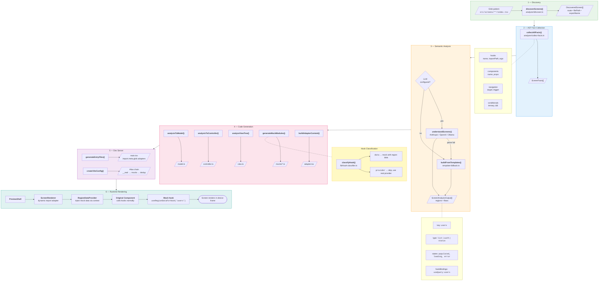
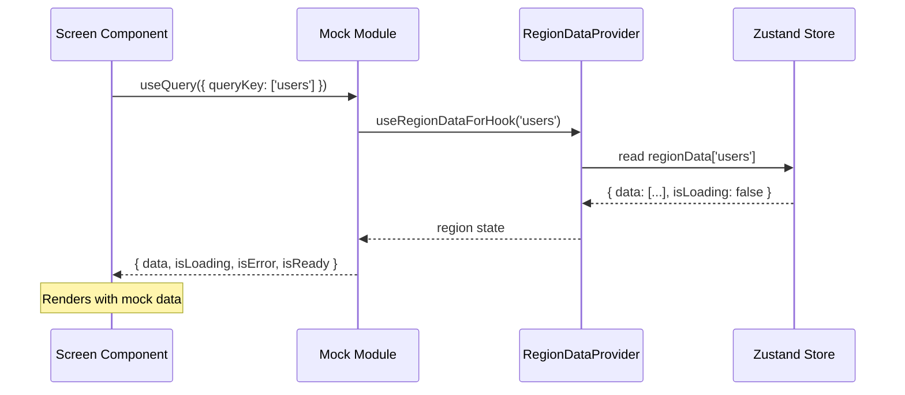

# Preview Tool

Preview any React app's screens in an isolated device-frame environment — without running the full app or backend.

Point it at a React codebase. It discovers pages/screens, identifies UI regions and their state machines, detects navigation flows, and generates mock wrappers so you can preview each screen in different states (loading, populated, empty, error) from a right-panel control surface.

## Quick Start

```bash
# Preview a local React project
preview /path/to/your-react-app

# Preview a GitHub repo
preview https://github.com/user/repo

# For monorepos, specify the frontend subdirectory
preview https://github.com/user/repo --path packages/web
```

This single command will:
1. Detect your framework (React, Next.js, Remix, etc.)
2. Discover all screens/pages
3. Analyze hooks, components, and navigation patterns
4. Generate preview wrappers with mock data
5. Start a dev server at `http://localhost:6100`

## Installation

```bash
# Clone and install
git clone https://github.com/user/preview-tool.git
cd preview-tool
pnpm install
pnpm build

# Link the CLI globally
cd packages/cli && pnpm link --global
```

Requires: Node.js 18+, pnpm

## Commands

### `preview <source>`

All-in-one command — resolves source, detects framework, generates artifacts, starts dev server.

```bash
preview /path/to/app                                          # Local project
preview https://github.com/user/repo                          # GitHub repo
preview /path/to/app --no-llm                                 # Skip LLM, use template fallback
preview /path/to/app --port 3000                              # Custom port
preview https://github.com/user/repo --path packages/web --keep  # Monorepo, keep temp clone
```

| Flag | Description |
|------|-------------|
| `--path <subdir>` | Subdirectory within a monorepo |
| `--keep` | Keep cloned temp directory on exit |
| `--no-llm` | Skip LLM analysis, use template-based fallback |
| `-p, --port <port>` | Dev server port (default: 6100) |

### `preview init`

Initialize the `.preview/` directory in an existing project.

```bash
preview init          # Interactive prompts
preview init --yes    # Accept defaults
```

Creates:
```
.preview/
  screens/              # Generated preview wrappers (auto-generated)
  overrides/            # Your custom overrides (user-maintained)
  mocks/                # Generated mock modules (auto-generated)
  wrapper.tsx           # App providers wrapper (user-maintained)
  preview.config.json   # Configuration
```

### `preview generate`

Discover screens and generate preview artifacts.

```bash
preview generate              # From current directory
preview generate --cwd /path  # Specify project directory
preview generate --no-llm     # Template fallback only
```

### `preview dev`

Start the preview dev server (assumes artifacts already generated).

```bash
preview dev                   # Use config defaults
preview dev --port 3000       # Custom port
```

**Requires:** Vite installed in the target project:
```bash
pnpm add -D vite @vitejs/plugin-react
```

## How It Works

### Per-Screen Data Flow



### Hook Lifecycle in Preview



### Pipeline Summary

| Stage | Function | Input | Output | Artifacts |
|-------|----------|-------|--------|-----------|
| 1. Discovery | `discoverScreens()` | glob pattern | `DiscoveredScreen[]` | -- |
| 2. Facts | `collectAllFacts()` | screens | `ScreenFacts[]` | -- |
| 3. Analysis | `understandScreens()` | facts | `ScreenAnalysisOutput[]` | -- |
| 4. Codegen | `analysisToModel()` | analysis | model + controller + view | `model.ts`, `controller.ts`, `view.ts` |
| 4. Mocks | `generateMockModules()` | facts + analysis | mock files + manifest | `mocks/*.ts`, `alias-manifest.json` |
| 5. Server | `createViteConfig()` | manifest | Vite config with aliases | `main.tsx`, `index.html` |
| 6. Runtime | `PreviewShell` | screen entries | rendered preview | browser |

### Detailed Stages

**Stage 1 — Screen Discovery:** Finds pages/screens via glob patterns (e.g., `src/screens/**/index.tsx`).

**Stage 2 — AST Fact Collection:** Extracts raw facts from each screen using TypeScript AST analysis:
- Hooks called (name, import path, arguments)
- Components rendered (name, props, children)
- Conditional rendering patterns (loading/error/empty branches)
- Navigation patterns (navigate calls, Link components, router.push)

**Stage 3 — LLM Understanding:** Sends facts + source code to an LLM which identifies:
- **Regions** — distinct UI sections (e.g., "Service List", "Booking Form")
- **States** — what each region can look like (loading, populated, empty, error)
- **Flows** — what happens when users click buttons (navigate, change region state)
- **Mock data** — realistic domain-specific data for each state

Falls back to a template library when no LLM is available.

**Stage 4 — Code Generation:** Produces per-screen artifacts:
- `model.ts` — regions with state machines and mock data
- `controller.ts` — flows (navigation + state transitions)
- `view.ts` — component tree metadata
- `adapter.tsx` — React wrapper connecting screen to mock data
- Mock modules replacing data-fetching hooks with region-aware mocks

**Hook Classification:** During mock generation, each hook is classified as `data` (needs mocking) or `provider` (skip mocking). Data hooks like `useQuery` and `useAuthStore` get mock replacements. Provider hooks like `useNavigate`, `useForm`, and `useTranslation` are left untouched and run via real providers in `wrapper.tsx`.

### LLM Providers

The tool uses an LLM to understand screen semantics. Configure via `.preview/preview.config.json`:

| Provider | Setup |
|----------|-------|
| `auto` (default) | Tries providers in order: claude-code, anthropic, openai, ollama |
| `claude-code` | Requires [Claude Code](https://claude.ai/code) installed |
| `anthropic` | Requires `ANTHROPIC_API_KEY` env var |
| `openai` | Requires `OPENAI_API_KEY` env var |
| `ollama` | Requires local [Ollama](https://ollama.ai) running |
| `none` | No LLM — uses template-based fallback only |

Without an LLM, the tool still works using pattern-matching templates (e.g., `useQuery` hooks get list regions with loading/populated/empty/error states).

## Configuration

`.preview/preview.config.json`:

```json
{
  "screenGlob": "src/screens/**/index.tsx",
  "port": 6100,
  "title": "Preview Tool",
  "llm": {
    "provider": "auto",
    "ollamaModel": "llama3.2",
    "ollamaUrl": "http://localhost:11434"
  }
}
```

| Field | Default | Description |
|-------|---------|-------------|
| `screenGlob` | `src/**/*.tsx` | Glob pattern to find screen files |
| `port` | `6100` | Dev server port |
| `title` | `Preview Tool` | Preview app title |
| `llm.provider` | `auto` | LLM provider selection |
| `llm.ollamaModel` | `llama3.2` | Ollama model name |
| `llm.ollamaUrl` | `http://localhost:11434` | Ollama server URL |

## Overrides

Generated models and controllers can be customized. Place override files in `.preview/overrides/<screen-name>/`:

```
.preview/overrides/
  dashboard/
    model.ts        # Custom regions/states for dashboard
    controller.ts   # Custom flows for dashboard
```

Override files are never overwritten by `preview generate`.

## Project Structure

```
packages/
  cli/              # @preview-tool/cli — Node.js CLI tool
    src/
      commands/     # CLI commands (init, dev, generate, preview)
      analyzer/     # AST analysis (screen discovery, fact collection)
      generator/    # Code generators (model, view, controller, mocks)
      resolver/     # Source resolution (framework detection, wrappers)
      server/       # Dev server (Vite config, entry point generation)
      llm/          # LLM integration (providers, prompts, schemas)
      lib/          # Shared utilities

  runtime/          # @preview-tool/runtime — React preview shell
    src/
      PreviewShell  # Main shell layout with device frames
      ScreenRenderer # Renders screens inside preview
      devtools/     # Inspector panel, scenario switcher
      flow/         # Flow engine (navigation simulation)
      preview/      # Device frames (iPhone, Pixel, iPad, Desktop)
      store/        # Zustand state management
```

## Development

```bash
pnpm install          # Install dependencies
pnpm build            # Build the CLI
pnpm test             # Build + run integration test against sample-app
```

Unit tests:
```bash
cd packages/cli
npx vitest run        # Run all unit tests
npx vitest --watch    # Watch mode
```

## Tech Stack

- **TypeScript** (strict mode) — compiled with `tsc`
- **ts-morph** — AST analysis and code generation
- **Commander** — CLI argument parsing
- **Zod** — schema validation
- **React 19 + Zustand** — runtime preview shell
- **Vite** — dev server
- **pnpm** workspaces — monorepo management
